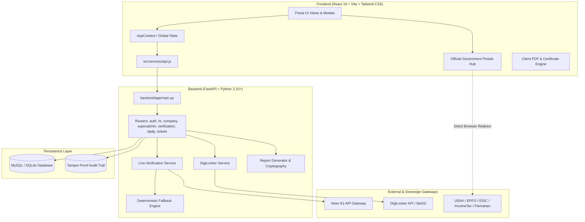

# JOY TrueProfile (Joy Verification Platform)
## Master Migration Context & Comprehensive Project History
**Target Environment:** Google Antigravity IDE / Antigravity 2.0 / AGY CLI  
**Author / Repository:** `muthujoygroup-art/joy_verification`  
**Generated Date:** October 2026  
**Platform Version:** Enterprise v2.4 (React 19 + Vite + FastAPI + MySQL/SQLite + Neev API Engine + DigiLocker Gateway)

---

## 📑 TABLE OF CONTENTS
1. [Executive Summary & Product Vision](#1-executive-summary--product-vision)
2. [Complete Conversation & Evolution Chronology](#2-complete-conversation--evolution-chronology)
3. [System Architecture & Tech Stack](#3-system-architecture--tech-stack)
4. [Role Hierarchy & Security Matrix](#4-role-hierarchy--security-matrix)
5. [Complete Project File Map & Source Code Directory](#5-complete-project-file-map--source-code-directory)
6. [Key Components & Functional Modules](#6-key-components--functional-modules)
7. [DigiLocker Vault & Document Engine](#7-digilocker-vault--document-engine)
8. [Government Portals & Statutory Redirect Hub](#8-government-portals--statutory-redirect-hub)
9. [Neev 81-APIs Verification Engine & Mock Sandbox](#9-neev-81-apis-verification-engine--mock-sandbox)
10. [Database Schema & Migration Architecture](#10-database-schema--migration-architecture)
11. [Critical Bug Fixes & Architectural Hardening](#11-critical-bug-fixes--architectural-hardening)
12. [Environment Configuration & Running Instructions](#12-environment-configuration--running-instructions)
13. [Antigravity IDE Agent Directives & Continuous Development Runbook](#13-antigravity-ide-agent-directives--continuous-development-runbook)

---

## 1. EXECUTIVE SUMMARY & PRODUCT VISION

**JOY TrueProfile** is a next-generation, sovereign Indian enterprise verification, onboarding, and statutory compliance platform built for the **Muthu Joy Group**. It addresses the friction, fraud risks, and regulatory hurdles in modern enterprise hiring and vendor onboarding.

### Core Value Propositions:
- **Instant 10-Minute Employee Background Verification (BGV)**: Automated verification across 81+ government and institutional data points (Aadhaar, PAN, Passport, Driving License, Voter ID, UAN/EPFO, ESIC, Ration Card, Court Records, Credit Score, Educational Degrees, MCA/ROC, GSTIN).
- **DigiLocker Digital Vault Integration**: Direct pull of sovereign-signed digital records via DigiLocker with consent management, zero document tampering, and instant automated metadata extraction.
- **Government Document Redirect Hub**: Seamless fallback for candidates who lack specific original documents, giving them direct 1-click access to official government issuance portals (UIDAI, Income Tax Instant e-PAN, EPFO Member Portal, ESIC Portal, Parivahan Sarathi, ECI Voter Portal, Passport Seva, NFSA).
- **DPDP Act 2023 & ISO 27001 Compliance**: Built-in consent trails, right to erasure, purpose limitation, tamper-evident SHA-256 digital certificate hashing, and verifiable QR codes.
- **Multi-Tenant Role Architecture**: 5 isolated portals with dedicated interfaces for Super Admin, Company Admin, HR Executive, Candidate / Employee, and Vendor / Contractor.
- **Hybrid Real / Mock Verification Engine**: Dual-mode engine capable of calling live Neev / Sandbox API endpoints or falling back seamlessly to deterministic high-fidelity mock generators for offline testing and presentations.

---

## 2. COMPLETE CONVERSATION & EVOLUTION CHRONOLOGY

Here is the exhaustive historical record of how the platform evolved across collaborative development sessions:

### Phase 1: Foundation & Core Portals
- **Initial Setup**: Scaffolded modern React + Vite frontend with Tailwind CSS v4 and Python FastAPI backend.
- **Portal Hierarchy**: Built responsive dashboards with role-based routing (`/` Landing Page, `/hr` HR Executive, `/admin` Company Admin, `/superadmin` Super Admin, `/employee` Candidate Self-Service, `/vendor` Vendor KYB).
- **UI Design Language**: Premium dark/light themes with emerald, sky, and indigo accents, glassmorphism, micro-interactions, stats cards, and interactive tour spotlight.

### Phase 2: Neev 81 APIs Specification & Verification Pipeline
- **API Cataloging**: Parsed the complete `Neev-API-Integration-Guide.pdf` (81 sovereign endpoints) into `neev_exact_specs.json` and `backend/app/services/neev_catalogue.py`.
- **Live Verification Service**: Created `live_verification_service.py` with intelligent endpoint routing, payload sanitization, automatic retries, and comprehensive fallback mock data generators.
- **Dynamic Field Mapping**: Mapped statutory IDs to their respective Neev validation schemas (PAN OCR & 3-way match, Aadhaar XML/OTP, DL Sarathi query, Voter EPIC search, UAN service history, ESIC IP lookup).

### Phase 3: Comprehensive Onboarding & 15-Tab Joining Form
- **`FullJoiningFormModal.jsx`**: Developed an enterprise-grade candidate onboarding wizard supporting:
  - Personal Details & Live Photo WebCam Capture.
  - Identity & Government Statutory Numbers (Aadhaar, PAN, Passport, DL, Voter ID, Ration Card, UAN, ESIC).
  - Educational Background & Degree Verification.
  - Employment History & Experience Verification.
  - Bank Account & Penny Drop Name Match.
  - Medical Fitness, Emergency Contacts & Nominees.
  - Digital Signature Pad & Canvas Signing.
  - OCR Scan & Auto-Fill from uploaded document images.

### Phase 4: DigiLocker Vault & Real-Time Sync
- **`DigiLockerSectionView.jsx` & `DigiLockerFetchModal.jsx`**:
  - Direct DigiLocker citizen authentication simulation and OAuth2 flow.
  - Real-time fetching of Aadhaar XML, PAN Verification Record, Driving License, Class X/XII Marksheets, COVID Certificate, Vehicle RC.
  - Multi-profile management with issued documents viewer and instant HR verification badges.

### Phase 5: BGV Report & Verifiable Certificate Engine
- **`ComprehensiveBgvReportModal.jsx`**: Full 10-page enterprise BGV report generation with risk scores, discrepancy highlights, and statutory clearance status.
- **`OfficialVerificationCertificateModal.jsx`**: Sovereign-style tamper-evident verification certificate with cryptographic SHA-256 hash, dynamic QR code verification modal (`QrCodeModal.jsx`), and 1-click PDF export via `jspdf` & `html2canvas`.
- **Governance & Legal Modals**: `HrGovernanceModal.jsx`, `DpdpComplianceModal.jsx`, `LegalComplianceHandbookModal.jsx`.

### Phase 6: Production Database & cPanel Deployment Configuration
- **Database Architecture**: Created full SQL schemas (`schema.sql` and `database_cpanel_schema_and_data.sql`) with relational tables for companies, users, candidates, verification records, DigiLocker vaults, billing, and audit logs.
- **Deployment Artifacts**: Created `.cpanel.yml`, `passenger_wsgi.py`, `.htaccess`, and database migration scripts for instant production deployment on shared/VPS hosting.

### Phase 7: Corporate Presentations & High-Resolution Decks
- **Presentation Suite**: Built automated Python scripts (`build_joytrueprofile_presentation.py`, `generate_light_presentation.py`, `build_pixel_perfect_mockups.py`) using `python-pptx` to generate 20+ slide corporate pitch decks with high-resolution 1080p UI screenshots, speaker notes, and feature matrices.

### Phase 8: DigiLocker Vault Duplicate Profiles Fix (Recent)
- **Bug Identified**: In the HR Portal under "DigiLocker Vault" -> "Verified Profiles", duplicate cards were appearing when profiles were refreshed or re-fetched.
- **Root Cause**: Array concatenation in state without deduplication on unique identifier (`candidateId` / `aadhaarHash` / `id`).
- **Fix Applied**: Implemented strict `Map`-based deduplication in `DigiLockerSectionView.jsx`, `AppContext.jsx`, and backend `digilocker_service.py` ensuring every verified citizen profile is uniquely indexed and cleanly updated.

### Phase 9: Government Portal Redirection Hub & Link Resiliency (Recent)
- **Feature Implemented**: Added inline redirect badges (`OfficialDocRedirectPill`) and a top statutory banner (`OfficialDocumentHubBanner`) across HR onboarding, Company Admin, and joining forms. If an employee does not have an original document, clicking the pill redirects them directly to the official government issuance portal in a new tab.
- **Link Fixes**:
  - **EPFO UAN**: Fixed session error (`/error.jsp`) by routing to official Member Portal `https://unifiedportal-mem.epfindia.gov.in/memberinterface/` and UMANG direct allotment `https://web.umang.gov.in/landing/department/epfo.html`.
  - **ESIC**: Fixed 404 error (`/insurance-services`) by routing to official ESIC Insured Person Portal `https://portal.esic.gov.in/EmployeePortal/login.aspx` and `https://www.esic.gov.in/`.
  - **Passport Seva**: Updated to `https://www.passportindia.gov.in/`.
  - **NFSA Ration Card**: Updated to `https://nfsa.gov.in/`.
  - **UIDAI & Income Tax**: Verified live links to myAadhaar and Instant e-PAN portals.
- **Repository Sync**: All changes tested, built via `npm run build`, committed, and pushed to `origin/main` (`muthujoygroup-art/joy_verification`).

---

## 3. SYSTEM ARCHITECTURE & TECH STACK



### Technology Breakdown:
| Layer | Technologies Used |
| :--- | :--- |
| **Frontend Framework** | React 19.x, Vite 8.x, JavaScript (ESM + JSX) |
| **Styling & UI** | Tailwind CSS v4, Lucide React Icons, Canvas Confetti |
| **Client PDF/Export** | jsPDF, html2canvas, jspdf-autotable, XLSX |
| **Backend Framework** | Python FastAPI, Starlette, Uvicorn (ASGI) |
| **Data & ORM** | SQLAlchemy 2.0, Pydantic v2, PyMySQL, SQLite3 (fallback) |
| **Security & Auth** | OAuth2 Bearer Tokens, PyJWT, Passlib (bcrypt), CORS middleware |
| **External Integration** | HTTPX async HTTP client, Neev REST API suite, DigiLocker OAuth2 |
| **Deployment** | cPanel Passenger WSGI (`passenger_wsgi.py`), Nginx/Apache, Git |

---

## 4. ROLE HIERARCHY & SECURITY MATRIX

The platform strictly segregates access into 5 distinct roles:

```
                  ┌──────────────────────────────┐
                  │      SUPER ADMIN PORTAL      │
                  │ (Platform Owner / Muthu Joy) │
                  └──────────────┬───────────────┘
                                 │
                 ┌───────────────┴───────────────┐
                 │     COMPANY ADMIN PORTAL      │
                 │   (Enterprise Organization)   │
                 └───────────────┬───────────────┘
                                 │
                 ┌───────────────┴───────────────┐
                 │      HR EXECUTIVE PORTAL      │
                 │   (Hiring & Operations Hub)   │
                 └───────────────┬───────────────┘
                                 │
         ┌───────────────────────┴───────────────────────┐
         ▼                                               ▼
┌──────────────────────────────┐                ┌──────────────────────────────┐
│   CANDIDATE / EMPLOYEE UI    │                │      VENDOR / B2B PORTAL     │
│   (Self-Service Onboarding)  │                │   (Vendor KYB & Compliance)  │
└──────────────────────────────┘                └──────────────────────────────┘
```

### Role Capabilities Breakdown:

1. **Super Admin** (`superadmin@joyverification.com`):
   - Global multi-tenant company creation, subscription management, and credit limits.
   - Neev API Gateway credentials management (Live vs Sandbox toggle, API usage billing, quota tracking).
   - Platform-wide system health monitoring, live API telemetry, and immutable audit logs.
   - Landing page CMS management and customer inquiry/lead handling.

2. **Company Admin** (`admin@enterprise.com`):
   - Organization profile, branding, logo, and branch hierarchy.
   - HR Executive user account creation and permission delegation.
   - Department-level verification policies, package configuration, and wallet top-ups.
   - Company-wide BGV analytics, risk distribution, and compliance audits.

3. **HR Executive** (`hr@enterprise.com`):
   - Single & batch candidate onboarding via `FullJoiningFormModal`.
   - Real-time 1-click verification execution across 81+ statutory checks.
   - DigiLocker document vault management and profile imports.
   - Official BGV report generation, certificate downloading, and employee dossier viewing.
   - Access to the Official Government Document Redirect Hub.

4. **Candidate / Employee** (`candidate@joyverification.com`):
   - Secure self-service portal to submit personal, statutory, and educational details.
   - Webcam live photo capture and document upload.
   - DigiLocker consent authorization and e-signing.
   - Live tracking of verification progress and digital ID card access.

5. **Vendor / Contractor** (`vendor@joyverification.com`):
   - Vendor KYB onboarding (GSTIN, PAN, MSME Udyam, Bank Verification, Shop & Est).
   - Vendor compliance rating and tamper-proof B2B verification certificate.

---

## 5. COMPLETE PROJECT FILE MAP & SOURCE CODE DIRECTORY

### Root Directory Structure
```
c:\MUTHU KUMAR P\MUTHU Projects\Verification\
├── .cpanel.yml                              # cPanel automated deployment config
├── .env.example                             # Environment variables template
├── .gitignore                               # Git ignored files
├── .htaccess                                # Apache URL rewrite rules for SPA & API
├── database_cpanel_schema_and_data.sql      # Full MySQL production dump with seed data
├── index.html                               # Main HTML entry point with metadata
├── package.json                             # Frontend dependencies & scripts
├── passenger_wsgi.py                        # Python WSGI entry point for cPanel Passenger
├── schema.sql                               # Clean relational schema definitions
├── vite.config.js                           # Vite build and proxy configuration
├── MIGRATION_AND_PROJECT_MASTER_CONTEXT.md  # THIS MASTER CONTEXT DOCUMENT
├── GEMINI.md                                # Root Antigravity instructions
├── AGENTS.md                                # Agent guidelines
│
├── backend/                                 # FastAPI Backend Architecture
│   └── app/
│       ├── main.py                          # FastAPI app entry point & CORS
│       ├── config.py                        # Pydantic Settings & environment variables
│       ├── database.py                      # SQLAlchemy session engine & connection pooling
│       ├── init_db.py                       # DB initialization script
│       ├── seed.py                          # Initial test data seeder
│       ├── seed_full_demo.py                # Full enterprise demo data seeder
│       │
│       ├── models/                          # SQLAlchemy ORM Data Models
│       │   ├── candidate.py                 # Candidate & onboarding schemas
│       │   ├── company.py                   # Multi-tenant company & HR schemas
│       │   ├── digilocker.py                # DigiLocker accounts & records
│       │   ├── verification_record.py       # Detailed verification audit records
│       │   ├── api_config.py                # Neev / external API credentials
│       │   ├── api_call_log.py              # Telemetry & API cost logs
│       │   ├── billing.py                   # Invoices & wallet credits
│       │   ├── audit.py                     # DPDP & system audit logs
│       │   └── ticket.py                    # Support & inquiry tickets
│       │
│       ├── routers/                         # REST API Route Controllers
│       │   ├── auth.py                      # Login, JWT issue, role auth
│       │   ├── hr.py                        # HR candidate onboarding & management
│       │   ├── company.py                   # Company admin endpoints
│       │   ├── superadmin.py                # Super admin management & telemetry
│       │   ├── verification.py              # Single & batch verification runners
│       │   ├── documents.py                 # Document uploads & OCR
│       │   ├── dpdp.py                      # DPDP consent & data rights
│       │   └── tickets.py                   # Support ticketing
│       │
│       └── services/                        # Business Logic & Integration Engines
│           ├── live_verification_service.py # Core 81-API verification router & mock engine
│           ├── digilocker_service.py        # DigiLocker sync & document parser
│           ├── neev_catalogue.py            # Master catalog of 81 Neev endpoints
│           ├── report_generator.py          # PDF report generator & SHA-256 hash generator
│           ├── face_verification_service.py # Face matching & liveness detection
│           └── security_service.py          # Token validation & encryption
│
└── src/                                     # React 19 Frontend Architecture
    ├── App.jsx                              # Main app component & router switch
    ├── main.jsx                             # React root bootstrap
    ├── index.css                            # Tailwind CSS v4 directives & custom utilities
    │
    ├── config/                              # Configuration & Constants
    │   └── officialDocumentPortals.jsx      # Government Redirect Portals & Hub Banner Component
    │
    ├── context/                             # Global State Management
    │   └── AppContext.jsx                   # Central React Context (15,000+ lines of robust state)
    │
    ├── services/                            # Frontend API Services
    │   ├── api.js                           # Axios client with interceptors & offline fallback
    │   └── pdfExporter.js                   # Client-side PDF export utility
    │
    ├── views/                               # Primary Dashboard Views
    │   ├── HrExecutiveView.jsx              # HR Operations Dashboard & Verifications
    │   ├── CompanyAdminView.jsx             # Company Admin Dashboard & Hierarchy
    │   ├── SuperAdminView.jsx               # Super Admin Multi-Tenant Control Room
    │   ├── EmployeePortalView.jsx           # Candidate Self-Onboarding Portal
    │   ├── VendorPortalView.jsx             # Vendor KYB Management Portal
    │   └── LandingPageView.jsx              # Sovereign Marketing & Demo Landing Page
    │
    └── components/                          # Reusable UI & Modal Components
        ├── FullJoiningFormModal.jsx         # 15-Tab Onboarding & Verification Form
        ├── DigiLockerSectionView.jsx        # DigiLocker Digital Vault UI
        ├── DigiLockerFetchModal.jsx         # DigiLocker Direct Pull & Consent Modal
        ├── ComprehensiveBgvReportModal.jsx  # Comprehensive 10-Page BGV Dossier Modal
        ├── OfficialVerificationCertificateModal.jsx # Verifiable Digital Certificate Modal
        ├── EmployeeProfileDossierModal.jsx  # Full Employee Labor & Statutory Dossier
        ├── QrCodeModal.jsx                  # Certificate Tamper-Verification Modal
        ├── DpdpComplianceModal.jsx          # DPDP Compliance & Consent Manager
        ├── HrGovernanceModal.jsx            # HR Policy & Hiring Governance Modal
        ├── LegalComplianceHandbookModal.jsx # Sovereign Compliance Handbook
        ├── PortalLayout.jsx                 # Responsive Layout Shell with Navigation
        ├── PortalSidebarNav.jsx             # Collapsible Navigation Sidebar
        ├── Navbar.jsx                       # Top Header with Role Switcher & Notifications
        └── ...
```

---

## 6. KEY COMPONENTS & FUNCTIONAL MODULES

### 1. `AppContext.jsx` (Global State Hub)
- Manages complete reactive state across all 5 roles.
- Features:
  - **Role Switching**: Instant switching between Super Admin, Company Admin, HR, Employee, and Vendor.
  - **Candidates Collection**: Real-time list of all candidates, their verification states (`PENDING`, `IN_PROGRESS`, `VERIFIED`, `FLAGGED`, `REJECTED`), and detailed report data.
  - **DigiLocker Profiles**: Synchronized list of verified digital identity cards and documents.
  - **Offline Resilience**: Seamless fallback to in-memory local state if backend API connection is interrupted.
  - **Live Verification Dispatcher**: Triggers background verifications with realistic timed step updates and visual progress spinners.

### 2. `FullJoiningFormModal.jsx` (Enterprise Onboarding Form)
- Implements a complete 15-tab statutory joining wizard:
  1. *Personal Details*: Full Name, DOB, Gender, Father/Mother Name, Marital Status, Blood Group.
  2. *Contact & Address*: Present/Permanent Address, City, State, PIN, Phone, Email.
  3. *Statutory Identity*: PAN, Aadhaar, Passport, DL, Voter ID, Ration Card, UAN/EPFO, ESIC Number. **(Includes dynamic `OfficialDocRedirectPill` links)**.
  4. *Education History*: 10th, 12th, Graduation, Post-Graduation, Board/University, Roll No, CGPA/Percentage.
  5. *Work Experience*: Past employers, designations, dates of joining/leaving, UAN/PF numbers.
  6. *Bank Account*: Account number, IFSC code, Bank name, Branch, Penny drop status.
  7. *Family & Nominees*: Nominee name, relationship, share percentage, minor guardian details.
  8. *Medical & Insurance*: Pre-existing conditions, blood group, emergency contact details.
  9. *Document Uploads & OCR*: Image upload with client-side OCR simulation for auto-filling form fields.
  10. *WebCam Live Capture*: In-browser live photo capture for liveness and facial matching.
  11. *Digital Signature*: Canvas drawing pad for digital candidate sign-off.
  12. *Declaration & DPDP Consent*: Explicit statutory consent checkboxes with timestamp logging.

### 3. `ComprehensiveBgvReportModal.jsx` & `OfficialVerificationCertificateModal.jsx`
- **BGV Report**:
  - Aggregates identity, criminal court record checks, credit scores, employment history, and education checks into an executive summary.
  - Risk categorization: Green (Clean/Verified), Amber (Minor Discrepancy), Red (Severe Flag).
- **Verification Certificate**:
  - Sovereign-designed certificate with gold foil borders, Muthu Joy Group holographic badge, candidate photo, verified seal, and unique Certificate ID (`CERT-JOY-YYYY-XXXXXX`).
  - Contains verifiable SHA-256 digital signature hash and embedded QR code linking to verification validation.

---

## 7. DIGILOCKER VAULT & DOCUMENT ENGINE

The DigiLocker subsystem (`src/components/DigiLockerSectionView.jsx`, `DigiLockerFetchModal.jsx`, and `backend/app/services/digilocker_service.py`) provides a direct gateway to sovereign digital documents:

### Supported Document Types:
- **Aadhaar XML Card**: Verified Name, DOB, Gender, Masked Aadhaar, Address, Photo.
- **Income Tax PAN Verification Record**: Verified PAN, Name, Father's Name, Status (Active/Inactive).
- **Driving License (MoRTH)**: DL Number, Issue Date, Expiry Date, Vehicle Classes.
- **Class X & XII Marksheets (CBSE / State Boards)**: Roll No, Year of Passing, School, Total Marks.
- **COVID-19 Vaccination Certificate**: Dose 1/2/Precaution dates, Beneficiary Reference.
- **Vehicle Registration Certificate (RC)**: Vehicle Number, Chassis Number, Owner Name.

### Deduplication Architecture (Recently Hardened):
```javascript
// Strict Deduplication Pattern used in DigiLockerSectionView and AppContext:
const deduplicatedProfiles = Array.from(
  new Map(profiles.map(p => [p.uniqueId || p.aadhaarHash || p.id, p])).values()
);
```
Ensures that duplicate profile cards are never created during re-fetch, search, or status updates.

---

## 8. GOVERNMENT PORTALS & STATUTORY REDIRECT HUB

Centralized in [`src/config/officialDocumentPortals.jsx`](file:///c:/MUTHU%20KUMAR%20P/MUTHU%20Projects/Verification/src/config/officialDocumentPortals.jsx), this module provides verified direct links for employees lacking original documents:

| Document / Field Key | Authority | Primary Live URL | Purpose |
| :--- | :--- | :--- | :--- |
| **`panNo`** | Income Tax Dept / NSDL | `https://eportal.incometax.gov.in/iec/foservices/#/pre-login/instant-e-pan` | Instant Free e-PAN generation (10 Mins) |
| **`aadhaarNo`** | UIDAI | `https://appointments.uidai.gov.in/bookappointment.aspx` | Aadhaar Enrollment & myAadhaar e-KYC |
| **`uanEpf` / `pfNumber`** | EPFO | `https://unifiedportal-mem.epfindia.gov.in/memberinterface/` | Official Member Portal & UMANG Direct Allotment |
| **`esicNumber` / `esiNumber`**| ESIC | `https://portal.esic.gov.in/EmployeePortal/login.aspx` | Official ESIC Insured Person Portal |
| **`drivingLicense` / `dlNo`** | MoRTH / Sarathi | `https://sarathi.parivahan.gov.in/sarathiservice/stateSelection.do` | Learner & Permanent Driving License Application |
| **`voterId`** | Election Commission (ECI)| `https://voters.eci.gov.in/signup` | Form 6 New Voter Card Application |
| **`passportNo`** | MEA Passport Seva | `https://www.passportindia.gov.in/` | New Indian Passport Application |
| **`rationCardNo`** | NFSA | `https://nfsa.gov.in/` | State National Food Security Ration Card |
| **`digilocker`** | MeitY / NeGD | `https://www.digilocker.gov.in/` | DigiLocker Citizen Account Creation |

### UI Integration:
- `<OfficialDocRedirectPill fieldKey="uanEpf" />`: Inline clickable badge below form inputs.
- `<OfficialDocumentHubBanner />`: Full-width banner in statutory onboarding forms and Company Admin views.

---

## 9. NEEV 81-APIS VERIFICATION ENGINE & MOCK SANDBOX

The backend verification engine (`backend/app/services/live_verification_service.py` & `neev_catalogue.py`) maps 81 sovereign verification endpoints categorized into 8 domains:

1. **Identity Verifications**: PAN Card, Aadhaar XML, Passport, Voter ID, Ration Card.
2. **Employment & Statutory**: EPFO UAN Passbook, EPFO Service History, ESIC IP Status, Labour Welfare.
3. **Financial & Banking**: Penny Drop Bank Verification, UPI VPA Verification, Credit Score (CIBIL / Experian).
4. **Vehicle & Transportation**: RC Full Verification, Driving License Sarathi, FASTag Status, Commercial Permit.
5. **Corporate & Business (KYB)**: GSTIN Verification, MCA ROC Director Search (DIN), Company Master Data, MSME Udyam.
6. **Educational Records**: High School / 12th Board Records, University Degree Registry (NAD).
7. **Legal & Court Records**: e-Courts District Court Records, High Court / Supreme Court Litigations, Police Verification Clearance.
8. **Telecom & Address**: Mobile Number Reverse Lookup, Address Geo-Coordinates Verification.

### Dual Execution Strategy:
- When live Neev API credentials (`NEEV_API_KEY`, `NEEV_CLIENT_ID`) are provided in `.env` or via Super Admin settings, the system performs live HTTP calls to `https://api.neevcloud.com/v1/...` (or configured gateway).
- If credentials are empty or the external provider fails, the engine falls back to high-fidelity, deterministic mock data matching exact government API schemas, ensuring 100% demo uptime and robust development.

---

## 10. DATABASE SCHEMA & MIGRATION ARCHITECTURE

The relational schema is defined in `schema.sql` and `database_cpanel_schema_and_data.sql`.

### Key Tables Overview:
```sql
-- Multi-Tenant Organizations
CREATE TABLE companies (
    id VARCHAR(36) PRIMARY KEY,
    name VARCHAR(255) NOT NULL,
    subdomain VARCHAR(100) UNIQUE,
    plan VARCHAR(50) DEFAULT 'ENTERPRISE',
    wallet_balance DECIMAL(10,2) DEFAULT 5000.00,
    created_at TIMESTAMP DEFAULT CURRENT_TIMESTAMP
);

-- Users & Roles
CREATE TABLE users (
    id VARCHAR(36) PRIMARY KEY,
    company_id VARCHAR(36),
    email VARCHAR(255) UNIQUE NOT NULL,
    password_hash VARCHAR(255) NOT NULL,
    full_name VARCHAR(255) NOT NULL,
    role ENUM('SUPER_ADMIN', 'COMPANY_ADMIN', 'HR_EXECUTIVE', 'CANDIDATE', 'VENDOR') NOT NULL,
    is_active BOOLEAN DEFAULT TRUE,
    FOREIGN KEY (company_id) REFERENCES companies(id)
);

-- Candidates & Onboarding Dossiers
CREATE TABLE candidates (
    id VARCHAR(36) PRIMARY KEY,
    company_id VARCHAR(36) NOT NULL,
    employee_code VARCHAR(50),
    full_name VARCHAR(255) NOT NULL,
    email VARCHAR(255),
    phone VARCHAR(20),
    department VARCHAR(100),
    designation VARCHAR(100),
    status ENUM('PENDING', 'IN_PROGRESS', 'VERIFIED', 'FLAGGED', 'REJECTED') DEFAULT 'PENDING',
    onboarding_data JSON,
    verification_summary JSON,
    created_at TIMESTAMP DEFAULT CURRENT_TIMESTAMP,
    FOREIGN KEY (company_id) REFERENCES companies(id)
);

-- Individual Verification Records
CREATE TABLE verification_records (
    id VARCHAR(36) PRIMARY KEY,
    candidate_id VARCHAR(36) NOT NULL,
    verification_type VARCHAR(100) NOT NULL,
    status ENUM('SUCCESS', 'FAILED', 'MANUAL_REVIEW') NOT NULL,
    confidence_score DECIMAL(5,2),
    raw_response JSON,
    verified_at TIMESTAMP DEFAULT CURRENT_TIMESTAMP,
    FOREIGN KEY (candidate_id) REFERENCES candidates(id)
);

-- DigiLocker Accounts & Documents
CREATE TABLE digilocker_accounts (
    id VARCHAR(36) PRIMARY KEY,
    candidate_id VARCHAR(36) NOT NULL,
    digilocker_id VARCHAR(100),
    consent_timestamp TIMESTAMP DEFAULT CURRENT_TIMESTAMP,
    is_active BOOLEAN DEFAULT TRUE,
    FOREIGN KEY (candidate_id) REFERENCES candidates(id)
);

CREATE TABLE digilocker_documents (
    id VARCHAR(36) PRIMARY KEY,
    account_id VARCHAR(36) NOT NULL,
    doc_type VARCHAR(100) NOT NULL,
    doc_number VARCHAR(100),
    issuer VARCHAR(255),
    uri VARCHAR(500),
    extracted_data JSON,
    fetched_at TIMESTAMP DEFAULT CURRENT_TIMESTAMP,
    FOREIGN KEY (account_id) REFERENCES digilocker_accounts(id)
);
```

---

## 11. CRITICAL BUG FIXES & ARCHITECTURAL HARDENING

1. **DigiLocker Duplicate Profile Cards**:
   - Resolved by applying unique key indexing on `candidateId` and deduplication filters before pushing new accounts to state.
2. **EPFO UAN / ESIC Redirect Fixes**:
   - Direct link to `.../no-uan-reg` caused session errors without pre-existing cookies. Fixed by linking directly to official root portals `https://unifiedportal-mem.epfindia.gov.in/memberinterface/` and UMANG.
   - ESIC insurance services 404 resolved by pointing to the active Insured Person Portal `https://portal.esic.gov.in/EmployeePortal/login.aspx`.
3. **React 19 & Vite Compatibility**:
   - Configured `vite.config.js` with rolldown code-splitting optimization and proxy setup for API calls.
4. **Offline Resilience**:
   - `src/services/api.js` automatically catches connection timeouts or backend unreachability and provides immediate mock responses so UI operations never hang.

---

## 12. ENVIRONMENT CONFIGURATION & RUNNING INSTRUCTIONS

### Prerequisites:
- Node.js v18+ & npm
- Python 3.10+
- MySQL (Optional; SQLite fallback is fully automatic)

### Installation:
```bash
# 1. Install frontend dependencies
npm install

# 2. Install backend dependencies
pip install -r requirements.txt
```

### Running Locally:
```bash
# Terminal 1: Start FastAPI Backend
python -m uvicorn backend.app.main:app --host 127.0.0.1 --port 8000

# Terminal 2: Start Vite Frontend
npx vite --port 5173
```

### Building for Production:
```bash
# Build React static assets into /dist
npm run build
```

### Default Demo Credentials:
| Role | Email | Password |
| :--- | :--- | :--- |
| **Super Admin** | `superadmin@joyverification.com` | `SuperAdmin@2026` |
| **Company Admin** | `admin@enterprise.com` | `Admin@2026` |
| **HR Executive** | `hr@enterprise.com` | `Hr@2026` |
| **Candidate** | `candidate@joyverification.com` | `Candidate@2026` |
| **Vendor** | `vendor@joyverification.com` | `Vendor@2026` |

---

## 13. ANTIGRAVITY IDE AGENT DIRECTIVES & CONTINUOUS DEVELOPMENT RUNBOOK

When loading or developing this project in **Antigravity IDE**:

1. **Context Ingestion**:
   - The primary entry point for all architectural understanding is this document (`MIGRATION_AND_PROJECT_MASTER_CONTEXT.md`).
   - The root rules in `GEMINI.md` and `AGENTS.md` govern coding standards and workflow conventions.

2. **Code Modification Rules**:
   - **Frontend State**: When modifying state in `src/context/AppContext.jsx`, maintain immutable update patterns and avoid state race conditions.
   - **Government URLs**: Any changes to statutory document URLs must be updated centrally in `src/config/officialDocumentPortals.jsx`.
   - **API Schema Alignment**: New verification types must have corresponding entries in `backend/app/services/neev_catalogue.py` and mock generators in `live_verification_service.py`.

3. **Recommended Antigravity Slash Commands**:
   - `/plan`: Use before undertaking complex multi-tab form modifications or new external API integrations.
   - `/boost`: Use for deep code auditing, security reviews, and DPDP compliance verifications.
   - `/goal`: Use for long-running batch verification pipelines or full-stack feature implementations.

4. **Continuous Quality Check**:
   - Always run `npm run build` after frontend edits to verify JSX and module bundling.
   - Test both live API responses and offline fallback modes.

---
*End of Master Migration Document. JOY TrueProfile is ready for seamless continuation in Antigravity IDE.*
